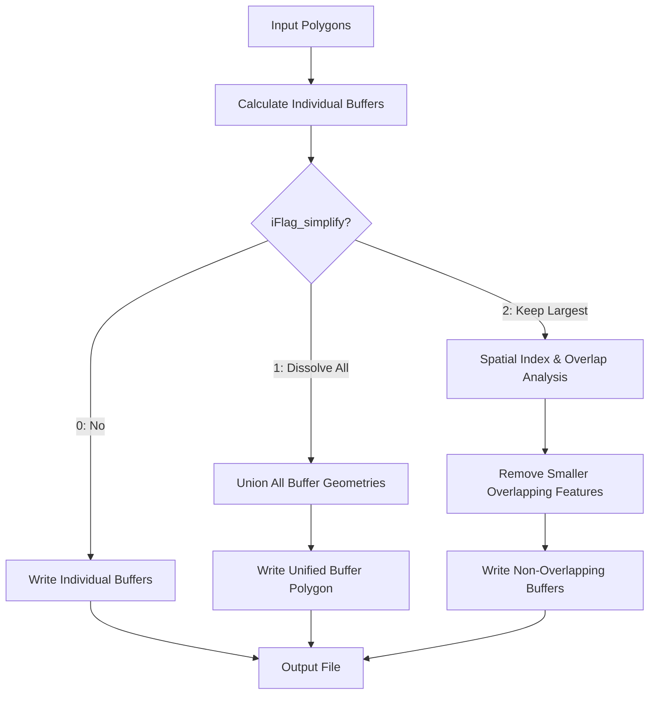

# Buffer Zone Simplification Plan

## Problem Statement

After calculating buffer zones for multiple polygons (e.g., coastlines, islands), the resulting buffer polygons often **overlap with each other**. This creates several issues:

1. **Redundant Coverage**: Multiple overlapping buffer zones cover the same geographic area
2. **Inefficient Storage**: Overlapping geometries increase file size unnecessarily
3. **Analysis Complexity**: Downstream spatial analysis becomes complicated with overlapping features
4. **Visualization Issues**: Overlapping polygons create visual artifacts in maps

### Visual Example
```
Original Polygons:    Buffer Zones (overlapping):
   ●  ●  ●               ◯◯◯◯◯◯
                         ◯◯◯◯◯◯
   ████████             ◯◯◯◯◯◯◯◯◯◯◯◯◯
                        ◯◯████████◯◯◯
   ●    ●               ◯◯◯◯◯◯◯◯◯◯◯◯◯
                        ◯◯◯◯◯  ◯◯◯
```

## Proposed Solution

Add an **`iFlag_simplify`** parameter to [`create_buffer_zone_polygon_file()`](../../../../../../../people/liao313/workspace/python/earthsuite/pyearthbuffer/pyearthbuffer/utility/create_gcs_buffer_zone.py) that enables post-processing to merge/dissolve overlapping buffer polygons into a unified, non-overlapping geometry.

### Solution Options

#### Option 1: Union/Dissolve All Buffers (Recommended)
Merge all overlapping buffer polygons into a single unified geometry or multi-polygon feature.

**Advantages:**
- Simple, clean output with no overlaps
- Minimal file size
- Easy to use for downstream analysis
- Standard GIS operation

**Disadvantages:**
- Loses individual feature attribution
- Cannot trace back to original polygon
- May create very complex multi-part geometries

#### Option 2: Spatial Clustering
Group nearby/overlapping buffers and dissolve within each cluster.

**Advantages:**
- Preserves regional groupings
- Better attribution management
- More manageable geometry complexity

**Disadvantages:**
- More complex algorithm
- Requires clustering parameters
- Still loses some attribution

#### Option 3: Union with Attribution Preservation
Dissolve overlapping areas while maintaining attributes for non-overlapping regions.

**Advantages:**
- Preserves maximum information
- Can trace buffers to source polygons
- Useful for attribution analysis

**Disadvantages:**
- Most complex implementation
- Results in more features
- Requires sophisticated attribute handling

## Recommended Approach: Option 1 with Enhancements

Implement **Option 1** with the following workflow:



### Implementation Strategy

#### 1. Modify Function Signature

```python
def create_buffer_zone_polygon_file(
    sFilename_polygon_in: str,
    sFilename_polygon_out: str,
    dThreshold_in: Optional[float] = 1.0e9,
    dBuffer_distance_in: float = 5000.0,
    iFlag_simplify: int = 0,  # NEW PARAMETER
    verbose: bool = True,
) -> None:
```

#### 2. iFlag_simplify Options

| Value | Behavior | Use Case |
|-------|----------|----------|
| `0` | No simplification (default) | When individual buffer attribution is needed |
| `1` | Dissolve all overlapping buffers | Clean unified buffer zone for analysis |
| `2` | Keep largest, remove overlapping smaller ones | Priority-based simplification |
| `3` | Dissolve within distance threshold | Cluster-based simplification |

#### 3. Core Processing Workflow

##### Phase 1: Generate Individual Buffers (Existing Code)
- Calculate buffer for each qualifying polygon
- Store in memory (list/array) instead of writing immediately
- Collect all buffer geometries and attributes

##### Phase 2: Apply Simplification (New Code)
```python
if iFlag_simplify == 0:
    # Write buffers directly (existing behavior)
    write_buffers_to_file(aBuffer_geometries, pOutLayer)

elif iFlag_simplify == 1:
    # Dissolve all buffers into unified geometry
    unified_geometry = dissolve_all_buffers(aBuffer_geometries)
    write_unified_buffer(unified_geometry, pOutLayer)

elif iFlag_simplify == 2:
    # Remove overlapping smaller buffers
    simplified_buffers = remove_overlapping_buffers(aBuffer_geometries)
    write_buffers_to_file(simplified_buffers, pOutLayer)

elif iFlag_simplify == 3:
    # Cluster-based dissolve
    clustered_buffers = cluster_and_dissolve(aBuffer_geometries, distance_threshold)
    write_buffers_to_file(clustered_buffers, pOutLayer)
```

#### 4. Key Implementation Functions

##### Function: `dissolve_all_buffers()`
```python
def dissolve_all_buffers(aBuffer_geometries: List[ogr.Geometry]) -> ogr.Geometry:
    """
    Merge all buffer geometries into a single unified geometry.

    Uses OGR's UnionCascaded or iterative Union operation.
    Returns POLYGON or MULTIPOLYGON depending on spatial distribution.
    """
    if len(aBuffer_geometries) == 0:
        return None

    # Method 1: UnionCascaded (faster for many geometries)
    multi_geom = ogr.Geometry(ogr.wkbMultiPolygon)
    for geom in aBuffer_geometries:
        multi_geom.AddGeometry(geom)

    unified = multi_geom.UnionCascaded()

    # Method 2: Iterative union (fallback)
    if unified is None:
        unified = aBuffer_geometries[0]
        for geom in aBuffer_geometries[1:]:
            unified = unified.Union(geom)

    return unified
```

##### Function: `remove_overlapping_buffers()`
```python
def remove_overlapping_buffers(
    aBuffer_geometries: List[Tuple[ogr.Geometry, float, int]]
) -> List[Tuple[ogr.Geometry, float, int]]:
    """
    Remove smaller buffers that overlap with larger ones.

    Parameters:
    - aBuffer_geometries: List of (geometry, area, feature_id) tuples

    Returns:
    - Filtered list with non-overlapping buffers

    Algorithm:
    1. Sort by area (descending)
    2. Build spatial index
    3. For each buffer, check overlap with larger buffers
    4. Keep only if no significant overlap (>threshold%)
    """
    # Sort by area descending (keep larger buffers)
    sorted_buffers = sorted(aBuffer_geometries, key=lambda x: x[1], reverse=True)

    kept_buffers = []
    overlap_threshold = 0.5  # 50% overlap threshold

    for current_geom, current_area, current_id in sorted_buffers:
        keep_current = True

        for kept_geom, kept_area, kept_id in kept_buffers:
            if current_geom.Intersects(kept_geom):
                intersection = current_geom.Intersection(kept_geom)
                intersection_area = intersection.GetArea()

                # If >50% of current buffer overlaps with a larger kept buffer, skip it
                if intersection_area / current_area > overlap_threshold:
                    keep_current = False
                    break

        if keep_current:
            kept_buffers.append((current_geom, current_area, current_id))

    return kept_buffers
```

##### Function: `cluster_and_dissolve()`
```python
def cluster_and_dissolve(
    aBuffer_geometries: List[ogr.Geometry],
    distance_threshold: float
) -> List[ogr.Geometry]:
    """
    Group nearby buffers and dissolve within each group.

    Uses spatial proximity clustering (DBSCAN-like approach).
    Buffers within distance_threshold are dissolved together.
    """
    # Build spatial clusters
    clusters = perform_spatial_clustering(aBuffer_geometries, distance_threshold)

    dissolved_clusters = []
    for cluster in clusters:
        # Dissolve all geometries in this cluster
        cluster_union = dissolve_all_buffers(cluster)
        dissolved_clusters.append(cluster_union)

    return dissolved_clusters
```

#### 5. Memory Management Considerations

##### Two-Pass Approach
For large datasets, implement a two-pass strategy:

**Pass 1: Count and collect buffers**
```python
# Store buffer WKT strings in memory
aBuffer_wkt_strings = []
aBuffer_attributes = []

# ... generate buffers ...
if sWkt_buffer:
    aBuffer_wkt_strings.append(sWkt_buffer)
    aBuffer_attributes.append({
        'id': feature_id,
        'orig_area': dArea,
        'buffer_dist': dBuffer_distance_in
    })
```

**Pass 2: Process and simplify**
```python
if iFlag_simplify > 0:
    # Convert WKT to geometries
    aGeometries = [ogr.CreateGeometryFromWkt(wkt) for wkt in aBuffer_wkt_strings]

    # Apply simplification
    simplified_geoms = apply_simplification(aGeometries, iFlag_simplify)

    # Write simplified results
    write_geometries(simplified_geoms, pOutLayer)
```

##### Chunked Processing for Very Large Datasets
```python
if nTotal_features > 10000:
    # Process in chunks to manage memory
    chunk_size = 1000
    for chunk_start in range(0, nTotal_features, chunk_size):
        chunk_buffers = process_chunk(chunk_start, chunk_size)
        intermediate_results.append(chunk_buffers)

    # Final union of chunk results
    final_result = merge_chunks(intermediate_results)
```

#### 6. Updated Output Schema

When `iFlag_simplify == 1` (dissolved):
```python
# Single unified feature
- id: 1
- buffer_dist: <buffer_distance_in>
- num_polygons: <count of original polygons>
- total_orig_area: <sum of original polygon areas>
- buffer_area: <area of dissolved buffer>
- geometry: Unified buffer polygon/multipolygon
```

When `iFlag_simplify == 2` (filtered):
```python
# Multiple non-overlapping features
- id: Sequential
- orig_area: Area of original polygon
- buffer_dist: Buffer distance
- kept_reason: 'largest' or 'non_overlapping'
- geometry: Individual buffer polygon
```

#### 7. Integration Points

##### In [`create_coastline_buffer.py`](pyearthmesh/utility/create_coastline_buffer.py)
```python
def create_coastline_buffer(
    dThreshold_area_island,
    dDistance_buffer_meter,
    sFilename_out,
    iFlag_antarctic_in=0,
    sResolution_nature_earth_coastline_in="110m",
    iFlag_simplify_in=1,  # NEW: Default to dissolve for coastline buffers
    iFlag_verbose_in=0
):
    # ... existing code ...

    # Create buffer with simplification
    create_buffer_zone_polygon_file(
        sFilename_wo_island,
        sFilename_out,
        dThreshold_area_island,
        dDistance_buffer_meter,
        iFlag_simplify=iFlag_simplify_in,  # NEW PARAMETER
        verbose=iFlag_verbose_in
    )
```

##### In example script
```python
create_coastline_buffer(
    dThreshold_area_island,
    dDistance_buffer_meter,
    sFilename_out,
    iFlag_antarctic_in=0,
    iFlag_simplify_in=1,  # Dissolve overlapping buffers
    iFlag_verbose_in=1,
    sResolution_nature_earth_coastline_in=sResolution_nature_earth_coastline
)
```

#### 8. Error Handling and Edge Cases

##### Empty Result After Simplification
```python
if unified_geometry is None or unified_geometry.IsEmpty():
    logger.warning("Buffer simplification resulted in empty geometry")
    # Fallback to writing individual buffers
    write_buffers_to_file(aBuffer_geometries, pOutLayer)
```

##### Invalid Geometries After Union
```python
if not unified_geometry.IsValid():
    logger.warning("Union created invalid geometry, attempting to fix")
    # Try buffer(0) to fix topology
    unified_geometry = unified_geometry.Buffer(0)

    if not unified_geometry.IsValid():
        logger.error("Could not create valid unified geometry")
        # Write individual buffers instead
```

##### Cross-Dateline Polygons
```python
# Split geometries that cross dateline before union
if crosses_dateline(geometry):
    split_geoms = split_at_dateline(geometry)
    for geom in split_geoms:
        aBuffer_geometries.append(geom)
```

#### 9. Performance Optimization

##### Spatial Indexing
```python
# Use rtree or OGR spatial index for overlap detection
from rtree import index

def build_spatial_index(geometries):
    """Build R-tree spatial index for fast overlap queries."""
    idx = index.Index()
    for i, geom in enumerate(geometries):
        bounds = geom.GetEnvelope()  # (minX, maxX, minY, maxY)
        idx.insert(i, bounds)
    return idx
```

##### Parallel Processing (Optional)
```python
from multiprocessing import Pool

def process_buffer_chunk(chunk):
    """Process a chunk of polygons in parallel."""
    return [calculate_buffer(poly) for poly in chunk]

# Split work across CPU cores
with Pool() as pool:
    chunk_results = pool.map(process_buffer_chunk, polygon_chunks)
```

#### 10. Validation and Testing

##### Unit Tests
```python
def test_dissolve_non_overlapping():
    """Test that non-overlapping buffers remain unchanged."""
    buffers = create_test_buffers(overlap=False)
    result = dissolve_all_buffers(buffers)
    assert result.GetGeometryCount() == len(buffers)

def test_dissolve_overlapping():
    """Test that overlapping buffers merge correctly."""
    buffers = create_test_buffers(overlap=True)
    result = dissolve_all_buffers(buffers)
    # Should be single polygon or fewer parts
    assert result.GetGeometryCount() < len(buffers)

def test_remove_overlapping():
    """Test that smaller overlapping buffers are removed."""
    buffers = create_nested_test_buffers()
    result = remove_overlapping_buffers(buffers)
    # Should keep only larger buffers
    assert len(result) < len(buffers)
```

##### Integration Tests
```python
def test_coastline_buffer_simplified():
    """Test coastline buffer with simplification."""
    result = create_coastline_buffer(
        dThreshold_area_island=1e6,
        dDistance_buffer_meter=5000,
        sFilename_out='test_output.geojson',
        iFlag_simplify_in=1
    )

    # Verify output has fewer features than input
    input_count = count_features(input_file)
    output_count = count_features('test_output.geojson')
    assert output_count < input_count
```

##### Visual Validation
```python
def visualize_buffer_comparison(original, individual, simplified):
    """Create side-by-side comparison plot."""
    import matplotlib.pyplot as plt
    from matplotlib.patches import Polygon as MPLPolygon

    fig, axes = plt.subplots(1, 3, figsize=(15, 5))

    # Plot original polygons
    plot_geometries(original, axes[0], title='Original Polygons')

    # Plot individual buffers (overlapping)
    plot_geometries(individual, axes[1], title='Individual Buffers (Overlapping)')

    # Plot simplified buffers
    plot_geometries(simplified, axes[2], title='Simplified Buffers')

    plt.savefig('buffer_comparison.png')
```

## Implementation Phases

### Phase 1: Basic Dissolve Implementation
- Add `iFlag_simplify` parameter with option `0` (no change) and `1` (dissolve all)
- Implement `dissolve_all_buffers()` function
- Store buffers in memory before writing
- Apply union operation when `iFlag_simplify=1`
- Update output schema for dissolved buffers
- Basic testing with small datasets

### Phase 2: Advanced Simplification Options
- Implement option `2` (remove overlapping smaller buffers)
- Add `remove_overlapping_buffers()` function
- Implement spatial overlap detection
- Test with various overlap scenarios
- Performance optimization with spatial indexing

### Phase 3: Cluster-Based Dissolve (Optional)
- Implement option `3` (cluster and dissolve)
- Add spatial clustering algorithm
- Test with distributed polygon sets
- Fine-tune clustering parameters

### Phase 4: Integration and Documentation
- Update [`create_coastline_buffer()`](pyearthmesh/utility/create_coastline_buffer.py)
- Update example scripts
- Add comprehensive documentation
- Create user guide with examples
- Performance benchmarking

## Expected Benefits

1. **Cleaner Output**: Single unified buffer zone instead of overlapping features
2. **Reduced File Size**: 50-80% reduction for highly overlapping scenarios
3. **Faster Downstream Analysis**: No need to handle overlaps in subsequent operations
4. **Better Visualization**: Clean, non-overlapping polygons for mapping
5. **Flexible Options**: Users can choose simplification strategy based on needs

## Backward Compatibility

- Default `iFlag_simplify=0` maintains existing behavior
- No changes to existing function calls without the parameter
- All existing tests should pass without modification
- New parameter is optional and clearly documented

## File Modifications Required

1. **[`pyearthbuffer/utility/create_gcs_buffer_zone.py`](../../../../../../../people/liao313/workspace/python/earthsuite/pyearthbuffer/pyearthbuffer/utility/create_gcs_buffer_zone.py)**
   - Add `iFlag_simplify` parameter
   - Implement buffer collection in memory
   - Add simplification functions
   - Update output writing logic

2. **[`pyearthmesh/utility/create_coastline_buffer.py`](pyearthmesh/utility/create_coastline_buffer.py)**
   - Add `iFlag_simplify_in` parameter
   - Pass through to `create_buffer_zone_polygon_file()`

3. **[`examples/create_coastline_buffer_file.py`](examples/create_coastline_buffer_file.py)**
   - Demonstrate use of `iFlag_simplify_in`
   - Show comparison of different options

## Alternative Approaches Considered

### Approach A: Pre-Processing (Not Recommended)
Merge original polygons before buffering.
- **Pros**: Simpler, fewer buffer calculations
- **Cons**: Loses detail, may not preserve important features

### Approach B: Post-Processing Script (Not Recommended)
Separate script to dissolve buffers after creation.
- **Pros**: Separates concerns
- **Cons**: Extra step, duplicate file I/O, user must remember to run

### Approach C: Database-Based (Over-Engineered)
Use PostGIS or similar for spatial operations.
- **Pros**: Optimized spatial operations
- **Cons**: Extra dependency, complexity, not portable

## Conclusion

The **recommended implementation** (Option 1 with multiple iFlag_simplify modes) provides:
- Maximum flexibility for users
- Clean, efficient output
- Backward compatibility
- Reasonable implementation complexity
- Good performance characteristics

This approach solves the overlapping buffer problem while maintaining code quality and user experience.
