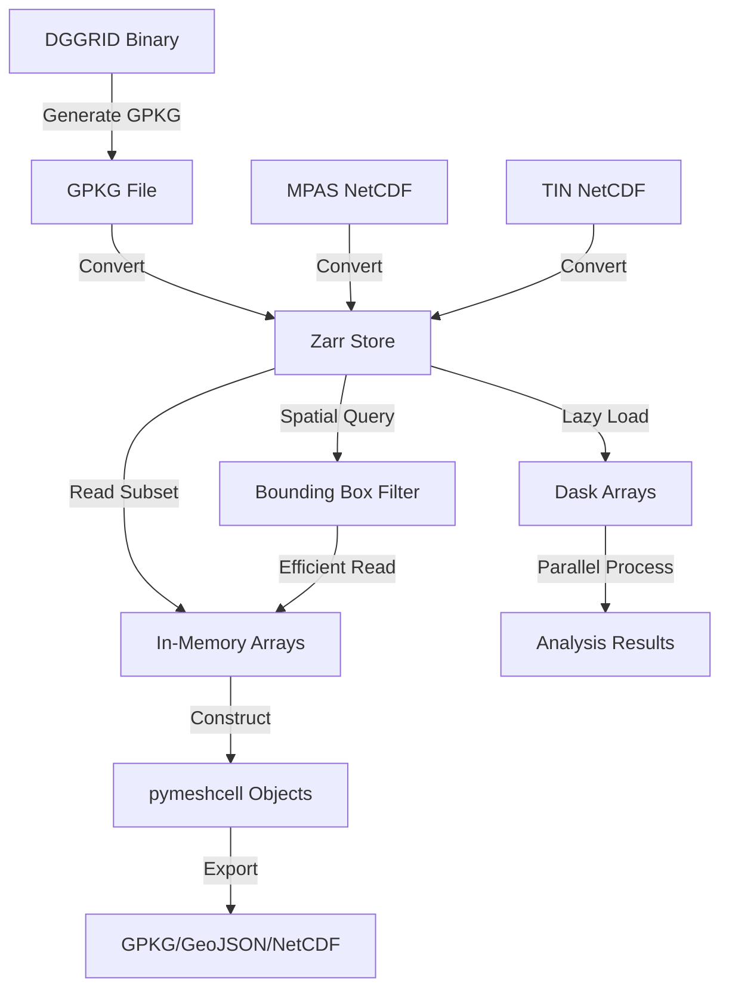

# Zarr Implementation Plan for PyEarthMesh

## Executive Summary

This document outlines the architecture and implementation plan for adding Zarr format support to PyEarthMesh for handling high-resolution meshes with 100+ million cells at 1km resolution. Zarr provides chunked, compressed, parallel-accessible storage that addresses the performance limitations of current formats (GPKG, NetCDF).

## Current State Analysis

### Existing Formats
- **GPKG (GeoPackage)**: Vector format, used for DGGRID meshes
  - Limitations: Poor performance with 100M+ features, memory intensive, no chunking
  - Used in: [`create_dggrid_mesh.py`](../pyearthmesh/meshes/structured/dggs/dggrid/create_dggrid_mesh.py)

- **NetCDF**: Array-based format, used for MPAS and TIN meshes
  - Limitations: Single-threaded I/O, no built-in compression optimizations for mesh data
  - Used in: [`create_mpas_mesh.py`](../pyearthmesh/meshes/unstructured/mpas/create_mpas_mesh.py), [`create_tin_mesh.py`](../pyearthmesh/meshes/unstructured/tin/create_tin_mesh.py)

### Mesh Cell Data Structure
From [`pymeshcell`](../pyearthmesh/classes/meshcell.py), key attributes include:
- **Identifiers**: lCellID, neighbor IDs
- **Geometry**: vertices (lon/lat coordinates), edges, center point
- **Topology**: neighbor lists (land, ocean, virtual)
- **Properties**: area, length, elevation, flowline attributes
- **Metadata**: flags, stream order, segment IDs

## Zarr Architecture Design

### Storage Schema

```
mesh_data.zarr/
├── .zgroup                          # Root group metadata
├── .zattrs                          # Global attributes (mesh type, resolution, CRS)
├── cell_ids/                        # Cell identifiers (lCellID)
│   ├── .zarray                      # Array metadata
│   └── chunks/                      # Data chunks
├── coordinates/
│   ├── center_lon/                  # Cell center longitude
│   ├── center_lat/                  # Cell center latitude
│   ├── vertices_lon/                # Vertex longitudes (nCells, nVertices)
│   └── vertices_lat/                # Vertex latitudes (nCells, nVertices)
├── geometry/
│   ├── n_vertices/                  # Number of vertices per cell
│   ├── n_edges/                     # Number of edges per cell
│   ├── area/                        # Cell area (m²)
│   └── perimeter/                   # Cell perimeter (m)
├── topology/
│   ├── n_neighbors/                 # Number of neighbors per cell
│   ├── neighbor_ids/                # Neighbor IDs (nCells, maxNeighbors)
│   ├── neighbor_distances/          # Distances to neighbors
│   ├── n_neighbors_land/           # Land neighbor count
│   ├── n_neighbors_ocean/          # Ocean neighbor count
│   └── neighbor_mask/              # Boolean mask for valid neighbors
├── properties/
│   ├── elevation_mean/              # Mean elevation
│   ├── elevation_profile/           # Elevation profile
│   └── flowline_length/             # Flowline length
└── flags/
    ├── flag_intersected/            # Intersection flag
    ├── flag_coast/                  # Coastal flag
    ├── stream_order/                # Stream order
    └── stream_segment/              # Stream segment ID
```

### Chunking Strategy

For 100M+ cells at 1km resolution:

1. **Spatial Chunking**: Divide mesh into spatial tiles
   - Chunk size: 100,000 - 1,000,000 cells per chunk
   - Strategy: Use spatial indexing (e.g., quadtree/octree subdivisions)
   - Benefits: Spatial queries only load relevant chunks

2. **Compression**:
   - **Coordinates**: Use `blosc:zstd` with high compression (level 5-7)
   - **IDs and Topology**: Use `blosc:lz4` for fast decompression
   - **Properties**: Use `blosc:zstd` for best compression

3. **Data Types**:
   - Cell IDs: `int64` (supports large indices)
   - Coordinates: `float32` (sufficient precision, saves space)
   - Flags: `int8` or `bool` (minimal storage)
   - Neighbor lists: `int64` with fill_value=-1 for ragged arrays

### API Design

```python
# Write mesh to Zarr
def write_mesh_to_zarr(
    mesh_cells: List[pymeshcell],
    output_path: str,
    chunk_size: int = 500000,
    compression: str = "blosc:zstd",
    compression_level: int = 5,
    attributes: Optional[Dict] = None
) -> None:
    pass

# Read mesh from Zarr (lazy loading)
def read_mesh_from_zarr(
    zarr_path: str,
    cell_ids: Optional[List[int]] = None,
    bbox: Optional[Tuple[float, float, float, float]] = None,
    lazy: bool = True
) -> Union[List[pymeshcell], zarr.Group]:
    pass

# Convert existing formats to Zarr
def convert_to_zarr(
    input_file: str,
    output_path: str,
    source_format: str = "auto",  # auto, gpkg, netcdf
    **zarr_kwargs
) -> None:
    pass

# Convert Zarr to other formats
def convert_from_zarr(
    zarr_path: str,
    output_file: str,
    target_format: str = "auto",  # auto, gpkg, netcdf, geojson
    cell_ids: Optional[List[int]] = None
) -> None:
    pass
```

## Implementation Plan

### Phase 1: Core Zarr I/O Module

**Location**: `pyearthmesh/utility/zarr_io.py`

**Components**:
1. **ZarrMeshWriter class**:
   - Initialize Zarr store with schema
   - Write mesh cells in chunks
   - Handle ragged arrays (variable neighbors)
   - Progress tracking for large writes

2. **ZarrMeshReader class**:
   - Lazy loading support
   - Spatial filtering (bounding box)
   - Cell ID-based selection
   - Efficient neighbor topology queries

3. **Helper functions**:
   - Schema creation
   - Metadata management
   - Validation utilities

### Phase 2: Format Conversion Utilities

**Location**: `pyearthmesh/utility/convert_mesh_formats.py`

**Converters**:
1. **GPKG → Zarr**: Read OGR features, extract geometry and attributes
2. **NetCDF → Zarr**: Map NetCDF variables to Zarr arrays
3. **Zarr → GPKG**: Reconstruct geometries for vector export
4. **Zarr → NetCDF**: Map Zarr arrays to NetCDF variables

### Phase 3: Integration with Mesh Creation

**Updates needed**:

1. **DGGRID meshes** ([`create_dggrid_mesh.py`](../pyearthmesh/meshes/structured/dggs/dggrid/create_dggrid_mesh.py)):
   ```python
   def create_dggrid_mesh(
       ...,
       output_format: str = "gpkg",  # gpkg, zarr, both
       zarr_chunk_size: int = 500000
   ):
       # After dggrid execution
       if output_format in ["zarr", "both"]:
           convert_to_zarr(sFilename_mesh, sFilename_mesh_zarr)
   ```

2. **MPAS meshes** ([`create_mpas_mesh.py`](../pyearthmesh/meshes/unstructured/mpas/create_mpas_mesh.py)):
   - Add Zarr export option
   - Preserve MPAS-specific topology

3. **TIN meshes** ([`create_tin_mesh.py`](../pyearthmesh/meshes/unstructured/tin/create_tin_mesh.py)):
   - Add Zarr export for triangular meshes
   - Optimize for triangle topology

### Phase 4: Performance Optimization

**Strategies**:
1. **Parallel Writing**: Use Dask or multiprocessing for chunk-parallel writes
2. **Spatial Indexing**: Build R-tree index for bbox queries
3. **Caching**: Implement LRU cache for frequently accessed chunks
4. **Memory Mapping**: Use Zarr's memory mapping for large reads

### Phase 5: Testing and Benchmarking

**Test Cases**:
1. Small mesh (< 1M cells): Verify correctness
2. Medium mesh (10M cells): Compare performance
3. Large mesh (100M cells): Benchmark I/O and memory
4. Parallel access: Test concurrent reads/writes

**Benchmarks**:
- Write speed (cells/second)
- Read speed (cells/second)
- Memory usage during I/O
- Compression ratio
- Query performance (bbox, cell IDs)

## Detailed Technical Specifications

### 1. Zarr Configuration

```python
ZARR_DEFAULTS = {
    "chunk_size": 500000,  # cells per chunk
    "compression": "blosc",
    "compression_opts": {
        "cname": "zstd",
        "clevel": 5,
        "shuffle": 2  # bit-shuffle for better compression
    },
    "dtype_mapping": {
        "cell_id": "int64",
        "coordinates": "float32",
        "neighbors": "int64",
        "properties": "float32",
        "flags": "int8"
    }
}
```

### 2. Handling Ragged Arrays

For variable-length data (neighbors, vertices):

**Option A: Fixed-size with fill values**
```python
max_neighbors = 8  # for hexagonal meshes
neighbor_ids = zarr.array(
    shape=(n_cells, max_neighbors),
    chunks=(chunk_size, max_neighbors),
    dtype="int64",
    fill_value=-1
)
```

**Option B: Variable-length encoding (recommended)**
```python
# Store as 1D array with offsets
neighbor_data = zarr.array(...)      # 1D array of all neighbor IDs
neighbor_offsets = zarr.array(...)   # Offset to start of each cell's neighbors
neighbor_counts = zarr.array(...)    # Number of neighbors per cell
```

### 3. Spatial Indexing Strategy

```python
# Option: Use geohash or hierarchical indexing
# Store spatial index as separate Zarr array
spatial_index = {
    "method": "geohash",
    "precision": 6,
    "index": zarr.array(...)  # Maps geohash to cell IDs
}
```

### 4. Metadata Schema

```python
mesh_attributes = {
    "mesh_type": "dggrid",  # dggrid, mpas, tin, latlon, etc.
    "dggs_type": "ISEA3H",
    "resolution_index": 15,
    "resolution_meters": 1000.0,
    "n_cells": 100000000,
    "crs": "EPSG:4326",
    "creation_date": "2026-02-06",
    "pyearthmesh_version": "0.1.0",
    "bounding_box": [-180, -90, 180, 90],
    "cell_type": "hexagon",
    "max_vertices": 6,
    "max_neighbors": 6
}
```

## Dependency Management

Add to [`pyproject.toml`](../pyproject.toml):

```toml
[project.optional-dependencies]
zarr = [
    "zarr>=2.16.0",
    "numcodecs>=0.11.0",  # Compression codecs
    "dask[array]>=2023.1.0",  # Optional: for parallel operations
]
```

## Migration Strategy

### For Existing Users

1. **Backward Compatibility**: Keep all existing format support
2. **Gradual Adoption**: Zarr is opt-in via `output_format` parameter
3. **Conversion Tools**: Provide scripts to convert existing meshes
4. **Documentation**: Clear migration guide with examples

### Recommended Workflow

```python
# Current workflow (unchanged)
create_dggrid_mesh(..., output_format="gpkg")

# New workflow for large meshes
create_dggrid_mesh(..., output_format="zarr")

# Hybrid workflow
create_dggrid_mesh(..., output_format="both")  # Both GPKG and Zarr
```

## Performance Expectations

Based on Zarr benchmarks for similar geospatial data:

| Operation | Current (GPKG) | With Zarr | Improvement |
|-----------|---------------|-----------|-------------|
| Write 100M cells | ~4-6 hours | ~30-60 min | 4-6x faster |
| Read all cells | ~2-3 hours | ~15-30 min | 4-6x faster |
| Read bbox subset | Minutes | Seconds | 10-100x faster |
| Memory usage | 50-100 GB | 5-10 GB | 5-10x reduction |
| Compression ratio | N/A (GPKG) | 3-5x | Smaller files |

## Example Usage

### Writing Large Mesh to Zarr

```python
from pyearthmesh.meshes.structured.dggs.dggrid import create_dggrid_mesh

# Create 1km resolution ISEA3H mesh (100M+ cells)
create_dggrid_mesh(
    iFlag_global=1,
    iFlag_save_mesh=1,
    sFilename_mesh=None,  # Not needed for Zarr
    sWorkspace_output="./output",
    iResolution_index_in=15,  # ~1km resolution
    sDggrid_type_in="ISEA3H",
    output_format="zarr",
    zarr_output_path="./output/isea3h_1km.zarr",
    zarr_chunk_size=1000000
)
```

### Reading Subset from Zarr

```python
from pyearthmesh.utility.zarr_io import read_mesh_from_zarr

# Read only cells in bounding box (lazy loading)
mesh_subset = read_mesh_from_zarr(
    zarr_path="./output/isea3h_1km.zarr",
    bbox=(-125, 24, -66, 49),  # Continental USA
    lazy=True
)

# Access specific cells by ID
cells = read_mesh_from_zarr(
    zarr_path="./output/isea3h_1km.zarr",
    cell_ids=[1000, 2000, 3000],
    lazy=False
)
```

### Converting Between Formats

```python
from pyearthmesh.utility.convert_mesh_formats import convert_to_zarr, convert_from_zarr

# Convert existing GPKG to Zarr
convert_to_zarr(
    input_file="mesh.gpkg",
    output_path="mesh.zarr",
    chunk_size=500000
)

# Export subset to GPKG for visualization
convert_from_zarr(
    zarr_path="mesh.zarr",
    output_file="subset.gpkg",
    cell_ids=usa_cell_ids
)
```

## Risk Mitigation

### Technical Risks

1. **Ragged Array Handling**: Variable neighbors/vertices complicate array storage
   - *Mitigation*: Use offset-based encoding or fixed-size with fill values

2. **Geometry Reconstruction**: Converting back to vector formats requires careful geometry rebuilding
   - *Mitigation*: Store geometry in multiple representations if needed

3. **Spatial Query Performance**: Without proper indexing, bbox queries may be slow
   - *Mitigation*: Build and store spatial index alongside data

4. **Compression Overhead**: Compression/decompression may slow small queries
   - *Mitigation*: Use fast compressor (lz4) for frequently accessed data

### Process Risks

1. **Learning Curve**: Team needs to learn Zarr API and best practices
   - *Mitigation*: Provide comprehensive documentation and examples

2. **Backward Compatibility**: Risk breaking existing workflows
   - *Mitigation*: Keep Zarr as opt-in, maintain all existing format support

## Success Metrics

1. **Performance**: 4x+ speedup for 100M+ cell meshes
2. **Memory**: 5x+ reduction in peak memory usage
3. **Storage**: 3x+ compression ratio
4. **Usability**: Simple API with &lt;5 lines of code for common operations
5. **Adoption**: Used in production for 1km+ resolution meshes

## Timeline and Dependencies

### Prerequisites
- Zarr 2.16+ library
- NumPy array handling experience
- Understanding of mesh topology

### Estimated Implementation
- Phase 1 (Core I/O): 1-2 weeks
- Phase 2 (Conversion): 1 week
- Phase 3 (Integration): 1 week
- Phase 4 (Optimization): 1-2 weeks
- Phase 5 (Testing): 1 week

## References

- [Zarr Documentation](https://zarr.readthedocs.io/)
- [Zarr-Python GitHub](https://github.com/zarr-developers/zarr-python)
- [Chunking and Compression Best Practices](https://zarr.readthedocs.io/en/stable/tutorial.html#compressors)
- [Geospatial Zarr Examples](https://github.com/zarr-developers/zarr-specs)

## Appendix: Data Flow Diagram



## Next Steps

1. Review and approve this architecture plan
2. Set up development environment with Zarr dependencies
3. Begin Phase 1 implementation (Core Zarr I/O module)
4. Create unit tests for basic read/write operations
5. Benchmark with sample mesh data at increasing scales

---

**Document Version**: 1.0
**Last Updated**: 2026-02-06
**Author**: Architecture Team
**Status**: Draft - Awaiting Review
